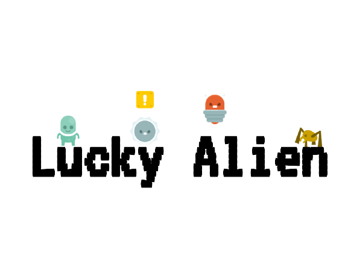
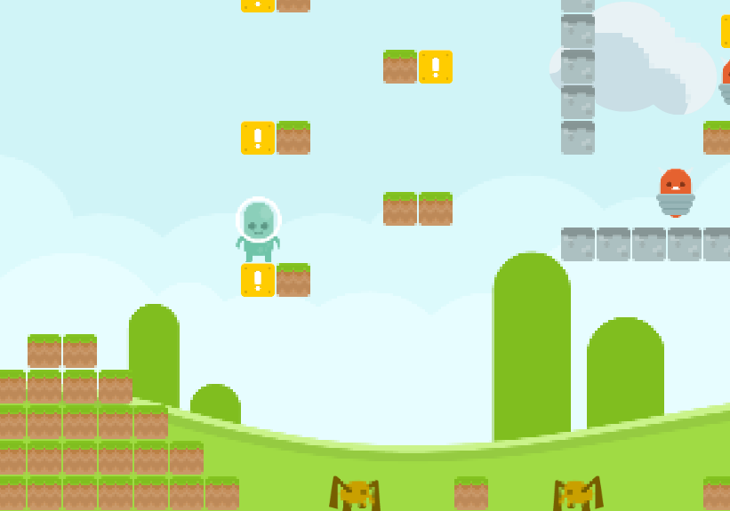

:four_leaf_clover: :alien: Lucky Alien, Adventure Island inspired RPG platformer\
[](https://deepscan.io/dashboard#view=project&tid=14666&pid=18758&bid=476737)

**Live Demo:** [thcheetah777.github.io/luckyalien/](https://thcheetah777.github.io/luckyalien/)\
**Itch.io:** [thcheetah777.itch.io/luckyalien/](https://thcheetah777.itch.io/luckyalien/)

## Description

#### **It's just a normal day in alienland...**

Lucky Alien is a [RPG](https://en.wikipedia.org/wiki/Role-playing_video_game) Platformer, According to **Wikipedia**, a RPG is a "*video game genre where the player controls the actions of a character immersed in some well-defined world*". The player, an alien, must go through many enemies by collecting powerups, and defeat the boss at the end.



## Getting Started

### Cloning

* Open your preferred command line or terminal
* Copy and enter this into the prompt

```
git clone https://github.com/thcheetah777/luckyalien/
```

* Wait for it to unpack
* After it's done cloning, enter

```
cd luckyalien
```

### Running the game

You need to set up the server via Python. (If you don't have Python, download it [here](https://www.python.org/)) Do this by entering
```
python -m http.server
```
or
```
python3 -m http.server
```
or
```python -m SimpleHTTPServer``` and ```python3 -m SimpleHTTPSServer``` on Linux machines
After you activate the server, got to [localhost:8000](http://localhost:8000/) to play the game

## Preview

https://user-images.githubusercontent.com/67921602/136305903-429d36f5-169d-4f68-a978-5ebe1ce025a2.mp4

## Contribution

Read [CONTRIBUTING.md](https://github.com/thcheetah777/luckyalien/blob/master/CONTRIBUTING.md) for more info

## Version History

| Version | Description |
| :------------- | :------------- |
| [v1.0](https://github.com/thcheetah777/luckyalien/releases/tag/v1.0) | This was the first release. The player is a stickman figure and the game doesn't have losing or winning |
| [v1.1](https://github.com/thcheetah777/luckyalien/releases/tag/v1.1) | Created first area |
| [v1.5](https://github.com/thcheetah777/luckyalien/releases/tag/v1.5) | Added a lot more new enemies and changed player image |
| [v1.6](https://github.com/thcheetah777/luckyalien/releases/tag/v1.6) | Added more area data plus powerups and SFX |

More to come! :grinning:

## License

This project is licensed under the MIT License - see the [LICENSE.md](https://github.com/thcheetah777/luckyalien/blob/master/LICENSE.md) file for full details

## Acknowledgments

* Inspiration: [Adventure Island 4](https://en.wikipedia.org/wiki/Adventure_Island_(video_game))
* Music: [Video Game Music (Kirby)](https://downloads.khinsider.com/game-soundtracks/album/kirby-the-very-best-of-kirby)
* Graphics: [Kenney.nl](https://kenney.nl/assets)
* Level Design: Me and sister
